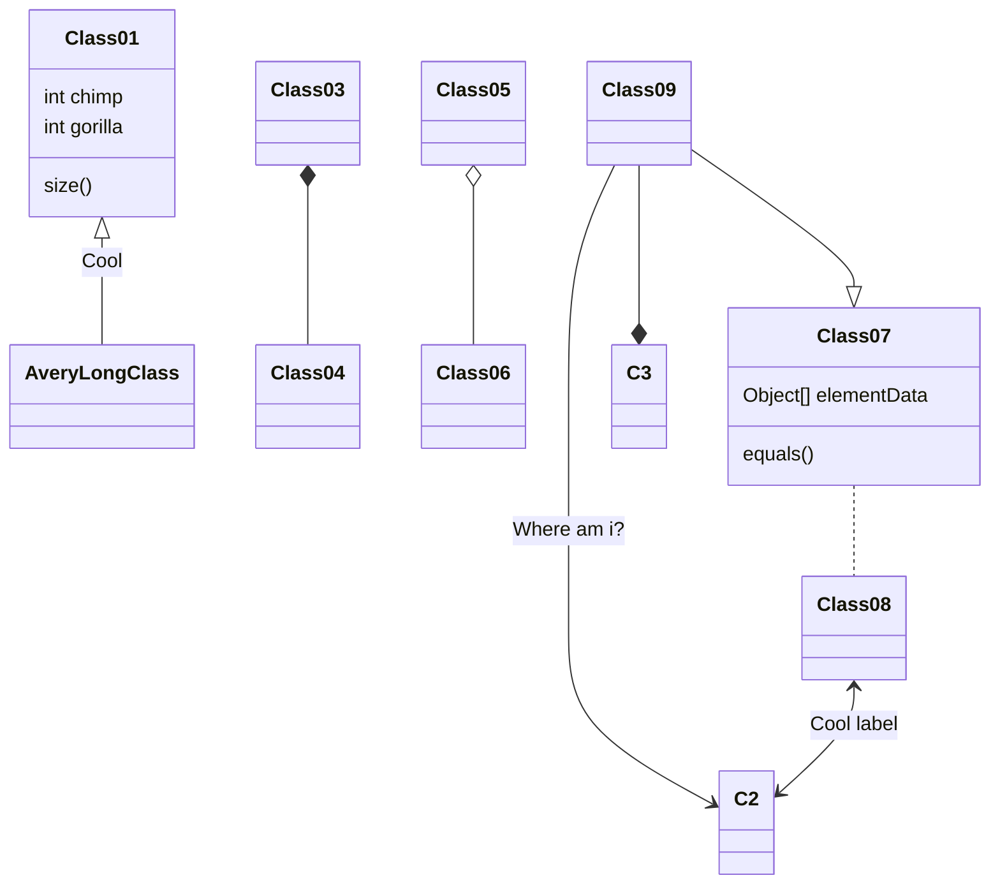

# Test 内容

官方指南 https://hexo.fluid-dev.com/

## Tag 测试

primary


secondary


success


danger


warning


info


light


## Mermaid 测试

```mermaid
classDiagram
Class01 <|-- AveryLongClass : Cool
Class03 *-- Class04
Class05 o-- Class06
Class07 .. Class08
Class09 --> C2 : Where am i?
Class09 --* C3
Class09 --|> Class07
Class07 : equals()
Class07 : Object[] elementData
Class01 : size()
Class01 : int chimp
Class01 : int gorilla
Class08 <--> C2: Cool label
```

## LaTex 测试
$$
E=mc^2
$$
